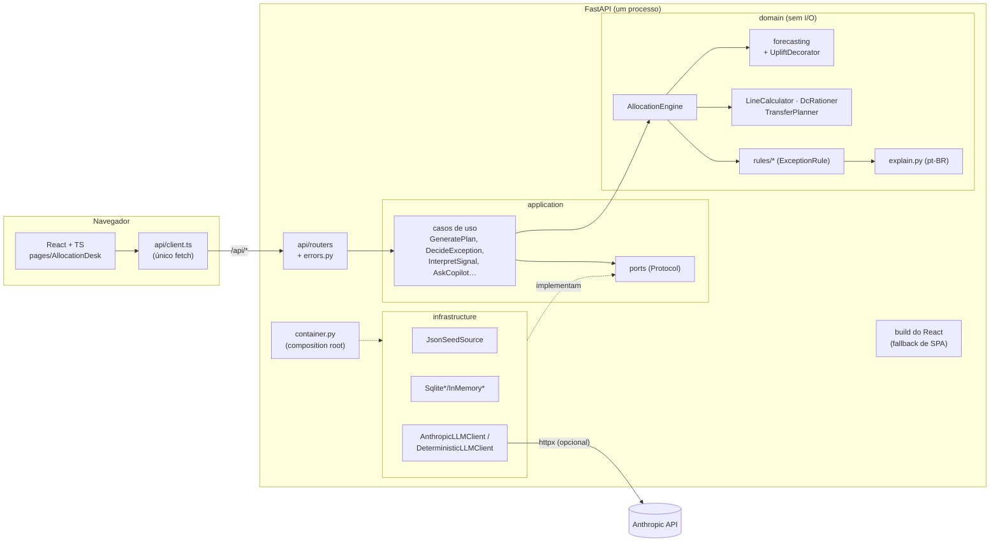

# Mesa de Alocação

Sistema AI First de **alocação e reposição de lojas de varejo de moda**. Todo dia o motor recalcula quanto cada loja deve ter de cada produto, em cada tamanho. O que está dentro da política segue sozinho. O que precisa de julgamento vira uma **exceção explicada** para o planejador.

**Tese do produto:** o planejador deixa de operar a planilha e passa a ser o dono das regras.

Com o seed da semana 41/2026 (8 lojas e 6 produtos), o motor avalia **248 linhas de decisão**. Destas, 131 seguem dentro da política, há 3 transferências entre lojas e **7 exceções** esperam o planejador. Tudo roda em **modo sombra**: o sistema recomenda e registra, e nada é escrito no ERP ou no WMS.

## Como rodar

Requisitos: Python 3.12+, Node 20+ e acesso a pypi.org e registry.npmjs.org.

```bash
python3.12 -m venv .venv
make install            # dependências do backend (com dev) e do frontend, e o Chromium do Playwright
make build && make run  # monolito em http://localhost:8000
make dev                # backend com reload na 8000 + Vite na 5173 (proxy de /api)
```

Se a porta 8000 estiver ocupada, use outra: `make run MESA_PORT=8010`.

### LLM real (opcional)

Sem chave, o sistema usa um adaptador **determinístico**, sem rede. Ele interpreta sinais e responde o copiloto por palavras-chave. Para usar o Claude, preencha o `.env` da raiz (fica fora do git; o modelo é o `.env.example`):

```bash
cp .env.example .env    # se ainda não existir
# edite .env: ANTHROPIC_API_KEY=sk-ant-...
make run                # make run e make dev carregam o .env (uvicorn --env-file)
```

Variáveis exportadas no shell também funcionam.

`GET /api/health` informa qual cliente está ativo (`anthropic` ou `deterministic`).

### Configuração (só por ambiente)

| Variável | Padrão | Uso |
|---|---|---|
| `MESA_DB_PATH` | `backend/data/mesa.db` | SQLite com decisões e auditoria |
| `MESA_SEED_PATH` | `backend/app/seed/seed.json` | dados da semana |
| `ANTHROPIC_API_KEY` | vazio | liga o adaptador Anthropic |
| `ANTHROPIC_MODEL` | `claude-haiku-4-5` | modelo do adaptador Anthropic |

## Arquitetura

Monolito modular em arquitetura hexagonal. A dependência sempre aponta para dentro, e só `container.py` instancia adaptadores.



Invariantes que o código garante:

1. **O LLM não faz contas.** Previsão, grade, rateio e transferências são código determinístico. O LLM só aparece em `InterpretSignal` e `AskCopilot`.
2. **Modo sombra.** Não existe port de escrita para ERP ou WMS.
3. **Texto de sinal é dado, não instrução.** A mensagem vai entre `<mensagem>` e `</mensagem>`, a saída do LLM é validada por schema (pydantic, com uma nova tentativa) e `requires_human` é recalculado pelo código.
4. **Toda decisão é auditada.** Cada aprovação, rejeição (com motivo) e desfazer grava um evento append-only.
5. **Franquia ≠ loja própria.** Loja própria recebe `ship` (envio). Franquia recebe `order_suggestion` (sugestão de pedido).

### Estrutura

```
backend/app/
  domain/          model, forecasting, allocation, engine, rules/, explain, signals, policy_catalog
  application/     ports, casos de uso, context_builder, prompts, signal_schema
  infrastructure/  seed_json, sqlite_repos, memory_repos, llm_anthropic, llm_deterministic, clock
  api/             schemas, errors, deps, routers/
  container.py     composition root
  main.py          create_app + SPA
backend/tests/     unit/ (domínio, aplicação, contratos, adaptadores) · feature/ (histórias + golden)
frontend/src/      api/ · hooks/ · components/ · pages/ · styles/tokens.css · test/
docs/adr/          decisões de arquitetura
```

## Decisões (ADRs)

O índice completo está em [docs/adr/README.md](docs/adr/README.md).

| Nº | Decisão |
|---|---|
| [0001](docs/adr/0001-registrar-decisoes-com-adrs.md) | Registrar decisões com ADRs |
| [0002](docs/adr/0002-monolito-modular-fastapi-react.md) | Monolito: FastAPI serve a API e o React |
| [0003](docs/adr/0003-arquitetura-hexagonal-solid.md) | Arquitetura hexagonal com SOLID |
| [0004](docs/adr/0004-motor-deterministico-llm-nao-calcula.md) | Motor determinístico; o LLM não calcula |
| [0005](docs/adr/0005-regras-de-excecao-plugaveis.md) | Regras de exceção plugáveis |
| [0006](docs/adr/0006-llmclient-como-port.md) | `LLMClient` como port |
| [0007](docs/adr/0007-modo-sombra.md) | Modo sombra |
| [0008](docs/adr/0008-persistencia-sqlite-seed-json.md) | SQLite e seed JSON |
| [0009](docs/adr/0009-estrategia-de-testes.md) | Pirâmide de testes |
| [0010](docs/adr/0010-frontend-react-ts-vite.md) | React + TS + Vite |
| [0011](docs/adr/0011-seguranca-e-governanca-de-ia.md) | Segurança e governança de IA |
| [0012](docs/adr/0012-parametros-implicitos-viram-politicas.md) | Parâmetros implícitos viram políticas |
| [0013](docs/adr/0013-interpretacoes-da-especificacao.md) | Interpretações da especificação |
| [0014](docs/adr/0014-ci-cd-github-actions-ghcr.md) | CI/CD: hooks, GitHub Actions e GHCR |

## Validações

| Comando | O que roda | Relatório |
|---|---|---|
| `make test` | ruff, mypy `--strict` (domain e application), pytest unit (cobertura ≥ 90%) e feature com golden (≥ 80%), Vitest (≥ 80% de linhas), ESLint e build | `reports/tests.md` |
| `python .claude/skills/revisar-solid/scripts/check_architecture.py backend/app` | fronteiras de camada e sinais de violação SOLID | saída no terminal e `reports/solid.md` |
| `python .claude/skills/validar-layout/scripts/validate_layout.py --url http://localhost:8000` | 390, 768 e 1280 px × claro e escuro: overflow, contraste AA, alvos de toque, testids, console e grid | `reports/layout/` |
| `make e2e` | 9 jornadas do planejador no navegador, incluindo prompt injection e celular | `reports/flows/flows.md` |
| `make validate` | todas as anteriores, sem parar na primeira falha | os acima |

Use o Python do venv (`.venv/bin/python`) nos comandos diretos. Dentro do Claude Code, `/validar` roda o diagnóstico completo.

## CI/CD

| Momento | O que roda | Onde |
|---|---|---|
| `git commit` | bloqueia `.env` e chaves `sk-ant-`; Conventional Commits; e, na área alterada, ruff + mypy + pytest unit + arquitetura (backend) ou ESLint + Vitest (frontend) | `.githooks/pre-commit`, `.githooks/commit-msg` |
| `git push` | suíte completa (`run_tests.sh`) + arquitetura | `.githooks/pre-push` |
| push ou PR no GitHub | jobs `testes`, `solid` e `e2e` (layout em 6 combinações e os 9 fluxos com Playwright); relatórios e capturas ficam nos artefatos do job | `.github/workflows/ci-cd.yml` |
| push na branch padrão ou tag `v*` (com CI verde) | build e publicação da imagem `ghcr.io/<owner>/<repo>` com as tags `sha-…`, `latest` e a versão | job `imagem` |

Os hooks são ativados com `make hooks`, que o `make install` também roda. Para rodar a imagem localmente:

```bash
make docker-build
make docker-run MESA_PORT=8010    # usa o .env, se existir; o banco fica no volume mesa-data
```

A chave da Anthropic nunca entra na imagem: passe em tempo de execução (`--env-file .env` ou `-e ANTHROPIC_API_KEY=...`). O deploy num ambiente ainda não está definido (ADR 0014).

## Kit do Claude Code

Este repositório nasceu do kit em `.claude/`: o comando `/construir-sistema`, as skills de domínio, backend, frontend e ADR e as skills de validação. A especificação é executável. O `seed.json` traz os dados da semana 41, o `expected_week41.json` é o golden e o `oracle.py` é a implementação de referência. Todos ficam em `.claude/skills/dominio-alocacao/`.
